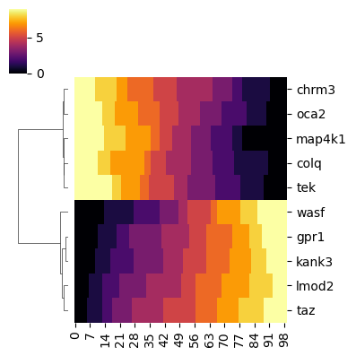
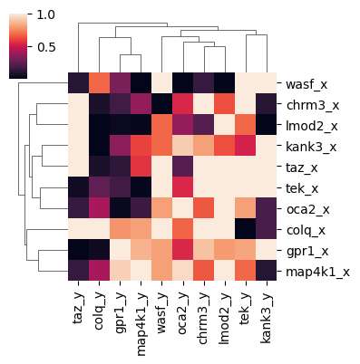

# gnr

<!-- WARNING: THIS FILE WAS AUTOGENERATED! DO NOT EDIT! -->

This file will become your README and also the index of your
documentation.

## Developer Guide

### Setup

``` sh
# create conda environment
$ mamba env create -f env.yml

# update conda environment
$ mamba env update -n gnr --file env.yml
# $ mamba env update -n gnr --file env.mac.yml
```

### Install

``` sh
pip install -e .

# install from pypi
pip install gnr
```

### nbdev

``` sh
# activate conda environment
$ conda activate gnr

# make sure the gnr package is installed in development mode
$ pip install -e .

# make changes under nbs/ directory
# ...

# compile to have changes apply to the gnr package
$ nbdev_prepare
```

Note: it might be useful to use the following snippet to enable hot
reloading:

``` python
%load_ext autoreload
%autoreload 2
```

### Publishing

``` sh
# publish to pypi
$ nbdev_pypi

# publish to conda
$ nbdev_conda --build_args '-c conda-forge'
```

# Usage

## Installation

Install latest from the GitHub
[repository](https://github.com/dsm-72/gnr):

``` sh
$ pip install git+https://github.com/dsm-72/gnr.git
```

or from [conda](https://anaconda.org/dsm-72/gnr)

``` sh
$ conda install -c dsm-72 gnr
```

or from [pypi](https://pypi.org/project/gnr/)

``` sh
$ pip install gnr
```

``` python
df_trj = make_mock_genes_x_tbins()
df_trj.head()
```

<div>
<style scoped>
    .dataframe tbody tr th:only-of-type {
        vertical-align: middle;
    }
&#10;    .dataframe tbody tr th {
        vertical-align: top;
    }
&#10;    .dataframe thead th {
        text-align: right;
    }
</style>

|       | 0   | 1   | 2   | 3   | 4   | 5   | 6   | 7   | 8   | 9   | ... | 90  | 91  | 92  | 93  | 94  | 95  | 96  | 97  | 98  | 99  |
|-------|-----|-----|-----|-----|-----|-----|-----|-----|-----|-----|-----|-----|-----|-----|-----|-----|-----|-----|-----|-----|-----|
| wasf  | 0   | 0   | 0   | 0   | 0   | 0   | 0   | 0   | 0   | 0   | ... | 9   | 9   | 9   | 9   | 9   | 9   | 9   | 9   | 9   | 9   |
| colq  | 9   | 9   | 9   | 9   | 9   | 9   | 9   | 9   | 9   | 9   | ... | 1   | 0   | 0   | 0   | 0   | 0   | 0   | 0   | 0   | 0   |
| gpr1  | 0   | 0   | 0   | 0   | 0   | 0   | 0   | 0   | 0   | 0   | ... | 9   | 9   | 9   | 9   | 9   | 9   | 9   | 9   | 9   | 9   |
| chrm3 | 9   | 9   | 9   | 9   | 9   | 9   | 9   | 9   | 9   | 9   | ... | 1   | 1   | 0   | 0   | 0   | 0   | 0   | 0   | 0   | 0   |
| lmod2 | 0   | 0   | 0   | 0   | 0   | 0   | 0   | 1   | 1   | 1   | ... | 8   | 8   | 8   | 9   | 9   | 9   | 9   | 9   | 9   | 9   |

<p>5 rows × 100 columns</p>
</div>

``` python
gc_op = GrangerCausality(n_jobs=2)
```

``` python
df_res = gc_op.fit_transform(df_trj, fit_params={'standard_scaler':True, 'signed_correlation': True})
```

``` python
df_res.head()
```

<div>
<style scoped>
    .dataframe tbody tr th:only-of-type {
        vertical-align: middle;
    }
&#10;    .dataframe tbody tr th {
        vertical-align: top;
    }
&#10;    .dataframe thead th {
        text-align: right;
    }
</style>

|         | wasf_y   | colq_y   | gpr1_y   | chrm3_y  | lmod2_y  | tek_y    | kank3_y  | oca2_y   | taz_y    | map4k1_y |
|---------|----------|----------|----------|----------|----------|----------|----------|----------|----------|----------|
| wasf_x  | 1.000000 | 0.683091 | 0.314458 | 0.144127 | 0.000818 | 1.000000 | 1.000000 | 0.000066 | 0.102470 | 0.006449 |
| colq_x  | 1.000000 | 1.000000 | 0.779284 | 1.000000 | 1.000000 | 0.001091 | 0.192685 | 0.675090 | 1.000000 | 0.806543 |
| gpr1_x  | 0.805541 | 0.042286 | 1.000000 | 0.892251 | 0.795418 | 0.823063 | 1.000000 | 0.542452 | 0.001091 | 0.852052 |
| chrm3_x | 0.001091 | 0.073638 | 0.168425 | 1.000000 | 0.632585 | 1.000000 | 0.102470 | 0.542452 | 1.000000 | 0.367649 |
| lmod2_x | 0.683091 | 0.000104 | 0.031086 | 0.220671 | 1.000000 | 0.683091 | 0.000818 | 0.367649 | 1.000000 | 0.017608 |

</div>

``` python
gc_op.plot_df_org(figsize=(4,4))
```



``` python
gc_op.plot_df_res(figsize=(4,4))
```



## Documentation

Documentation can be found hosted on GitHub
[repository](https://github.com/dsm-72/gnr)
[pages](https://dsm-72.github.io/gnr/). Additionally you can find
package manager specific guidelines on
[conda](https://anaconda.org/dsm-72/gnr) and
[pypi](https://pypi.org/project/gnr/) respectively.
